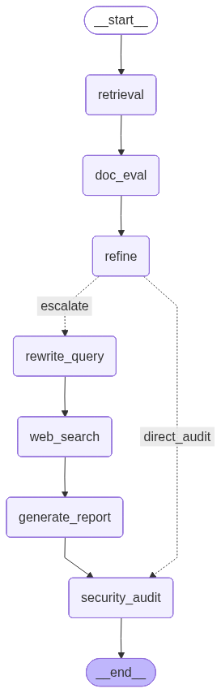
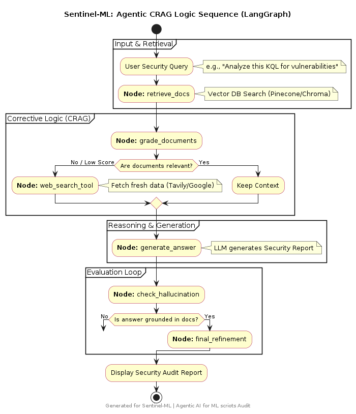

# 🛡️ Sentinel-ML: Security-First Agentic CRAG

Autonomous AI Agent System for Auditing ML Workflows via LangGraph & Corrective RAG.

## 🔍 Overview

**Sentinel-ML** is an intelligent security layer for the ML lifecycle. It doesn't just scan code; it understands the context of training, deployment, and inference scripts to intercept vulnerabilities before they reach production.

## 🚀 Why Sentinel-ML?

Standard LLMs often provide insecure code snippets or hallucinate outdated security patches. Sentinel-ML solves this by treating security as a Stateful Engineering Problem, not just a prompting task.

### 🧠 Architecture & Logic

Sentinel-ML is not a simple wrapper. It uses a **Directed Acyclic Graph (DAG)** via LangGraph to manage the audit state:

1. **Contextual Retrieval**: Proactively fetches framework-specific security signatures.
2. **Corrective Grading**: Self-evaluates retrieved data quality (`GOOD`, `AMBIGUOUS`, `INCORRECT`).
3. **Recursive Re-writing**: Dynamically optimizes queries to trigger targeted web searches when local knowledge is insufficient.
4. **Final Security Audit**: The final reasoning gatekeeper against RCE, Model Poisoning, and Path Injection.

## 📊 Agent flow

### Node sequence



### Internal execution flow



## ⚡Demonstration

**Problem**: Insecure model loading using `pickle` (Remote Code Execution risk).

**Sentinel-ML Solution**: Seamless migration to high-performance, safe alternatives like `safetensors`.

```python
res = app.invoke({
    "question": "Find vulnerabilities in this model loading script and provide a secure, high-performance alternative.",
    "vulnerable_code": """import pickle
    import pandas as pd
    def load_user_model(user_id):
        # DANGEROUS: Loading model from untrusted user path
        path = f"models/{user_id}_model.pkl"
        with open(path, 'rb') as f:
            model = pickle.load(f) # <--- Potential RCE Vulnerability
        return model
    """,
    "query": "Find vulnerabilities in this model loading script and provide a secure, high-performance alternative.",
    "web_docs": [],
    "fixed_code_cost_reduced": "",
    "entire_fixed_code": "",
    "final_report": None,
    "display_report": "",
    "docs": [],
    "good_docs": [],
    "kept_strips": [],
    "strips": [],
    "refined_context": "",
    "recommend_fix_only": False,
    "verdict": " ",
    "reason": " ",
    "web_queries": [],
    "fix_recommendations": set()
})

print("Fixed code with reduced computational cost:\n", res['fixed_code_cost_reduced'])
```

### Output

```text
Fixed code with reduced computational cost:
from pathlib import Path
from safetensors.torch import load_file

def load_user_model(user_id):
    # Optimized safe loading: uses zero-copy memory mapping via safetensors
    # Minimalist path sanitization to reduce overhead
    safe_id = Path(user_id).name
    path = Path("models") / f"{safe_id}_model.safetensors"

    # load_file is significantly faster than pickle and inherently safe
    return load_file(str(path))
```

## 🛠️ Key Capabilities

- **Vulnerability Detection**: Identifies Data Leakage, Model Poisoning, and Adversarial Vectors.
- **Best Practices Recommendations**: Uses CRAG to verify all recommendations against live web data.
- **Automated Analysis**: Provides deep-dive security reports with zero manual intervention.
- **Integration with CI/CD**: State-persistent logic designed for automated pipeline security gates.

## 📦 Installation and setup

To use the Sentinel-ML Security CRAG AI-agent, follow these steps:

1. Clone the repository:

   ```bash
   git clone https://github.com/JackTheProgrammer/Sentinel-ML-security-CRAG-agent.git
   ```

2. Install the required dependencies:

   ```bash
    pip install -r configs/requirements.txt
   ```

3. Use the code from the jupyter notebook `notebooks/sentinel_ml_security_crag_demo.ipynb` to see the agent in action.
